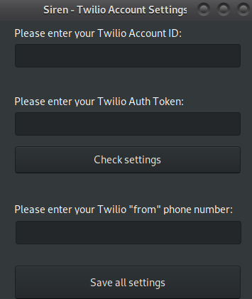

## Important Note

The **very morning after** this code was posted on Github, Twilio announced that they were changing some of their policies & rules, specifically for non-profits. This program was suddenly against the rules.

I'm leaving this code up here for now but I will not add build instructions or binary releases as I originally promised below.

It's unfortunate that Twilio decided to make mass texting & efficient outreach *even more difficult* for non-profit and political organizations. It's a capitalist's world.

# Siren

Siren is a *Twilio* frontend designed to make **mass text message campaigns** cheaper & more accessible for **non-profit organizations**

Most online *"mass texting"* services, especially those preying on non-profits, use Twilio as their back-end and implement **10,000% and more** *surcharges*, with many of these platforms charging **hundreds of dollars a month**.

Some small percentage of this surchage serves to cover their maintenance costs, but the vast majority of it is just to *take advantage* of well-meaning organizations trying to be effective in their outreach.

Siren is a **free & open-source** desktop frontend for Twilio, rather than a web service frontend. As such, there are no maintenance costs. The only cost to the user will be the small fees charged by the Twilio service itself (for most organizations, only a few dollars per month)

## Usage

Siren requires a Twilio account (Account ID, Auth Token, and "from" phone number)

## Building

Build instructions coming soon
