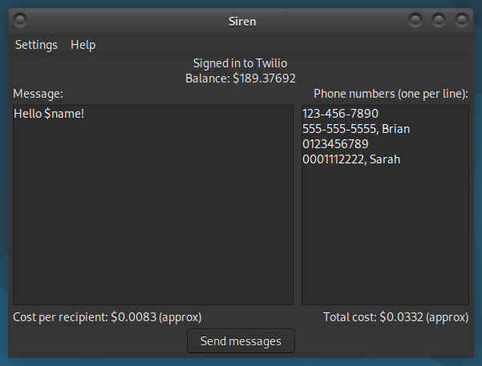
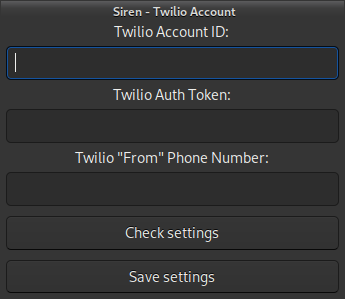

# Siren

Siren is a cross-platform *Twilio* frontend designed to make **mass text message campaigns** cheaper & more accessible for **non-profit organizations** and clubs.

> No one else has ever sailed past this place in his black ship until he has listened to the honey-sweet voice that issues from our lips;
> then goes on, well-pleased, knowing more than he ever did.

– *The Odyssey*, Book 12

## About

Most online *"mass texting"* services, especially those preying on non-profits, use Twilio as their back-end and implement **10,000% and more** *surcharges*, with many of these platforms charging **hundreds of dollars a month**.

Some small percentage of this surchage serves to cover their maintenance costs, but the vast majority of it is just to *take advantage* of well-meaning organizations.

Siren is a **free & open-source** desktop frontend for Twilio, rather than a web service frontend. As such, there are no maintenance costs. The only cost to the user will be the fees charged by the Twilio service itself (for most organizations, only a few dollars per month)

## Usage



Siren requires a Twilio account (Account ID, Auth Token, and "from" phone number)



### Sending a message

You must be logged in to your Twilio account to send messages.

Enter the list of phone numbers, one per line, in the right-hand box. Enter the message you want to send in the left-hand box. Click "Send messages" to send the message.

**IMPORTANT NOTES**:

- If you write a message that is longer than 160 characters, it will be split into multiple texts.

- Each message will have the text "(stop=quit)" appended to the end of it, as **required by law**.

- Certain characters (like emojis) cannot be sent in a message.
  - Siren will automatically remove these characters -- if it did not, the cost of each message could multiply 3x or more.

- Siren will silently refuse to send messages to phone numbers that have unsubscribed from your messages.
  - This is **required by law**, and Twilio will not allow you to send messages to these numbers.

- Siren will also silently refuse to send messages to duplicate phone numbers
  - If the same number appears multiple times in your list, it will only be sent to once.

- Sending may take a while, as Siren must delay for a few seconds between each message to comply with Twilio's rate limits.

**USEFUL TIPS**:

- The estimated cost-per-recipient and total cost are displayed at the bottom of the window.
  - This is only an estimate, and prices may vary slightly based on taxes, fees, different carriers, and other factors.

- If you write `$name` in your message, it will be replaced with the recipient's name if you provide a name for that recipient in the list of phone numbers. For example, if you write:

```
Hello $name, this is a test message.
```

And you provide the following list of phone numbers:

```
1234567890, John Doe
0987654321, Jane Smith
```

Then the message sent to John Doe will be:

```
Hello John Doe, this is a test message.
```

- You can see the list of unsubscribed numbers by clicking `Help` -> `View Unsubscribed Numbers`.
  - This will show you a list of all the numbers that have unsubscribed from your messages, or are invalid numbers that cannot be sent to.

### Signing in to your Twilio account

You can sign in to your Twilio account by clicking `Settings` -> `Twilio Account` and entering your Account SID, Auth Token, and "from" phone number. You can find these values in your Twilio account dashboard.

You can press the "Check settings" button to verify that your Twilio account is valid and that the "from" phone number is correct.

Once you've signed in, you can send messages to your recipients, and Siren will display your available account balance at the top of the window.

## Building

### GNU/Linux

### Windows

Requirements:

 - [MSYS2](https://www.msys2.org/)
   - `mingw-w64-ucrt-x86_64-gcc`
   - `mingw-w64-ucrt-x86_64-make`
   - `mingw-w64-ucrt-x86_64-pkgconf`
   - `mingw-w64-ucrt-x86_64-wxwidgets3.2`
   - `mingw-w64-ucrt-x86_64-curl`
   - `mingw-w64-ucrt-x86_64-nlohmann-json`
 - [Inno Setup 7](https://jrsoftware.org/isdl.php) (optional, if you want to build the installer)

Open the MSYS2 UCRT64 shell, and run the following commands:

```bash
git clone https://github.com/rail5/siren.git && cd siren
mingw32-make -j
```

After this point, `bin/siren.exe` will exist, and you can run it directly.

You can build the installer (if you want) by opening the `siren-installer.iss` file with Inno Setup 7, and clicking "Compile". Afterwards, the installer will be located in `bin/Siren-Installer.exe`.

### macOS
